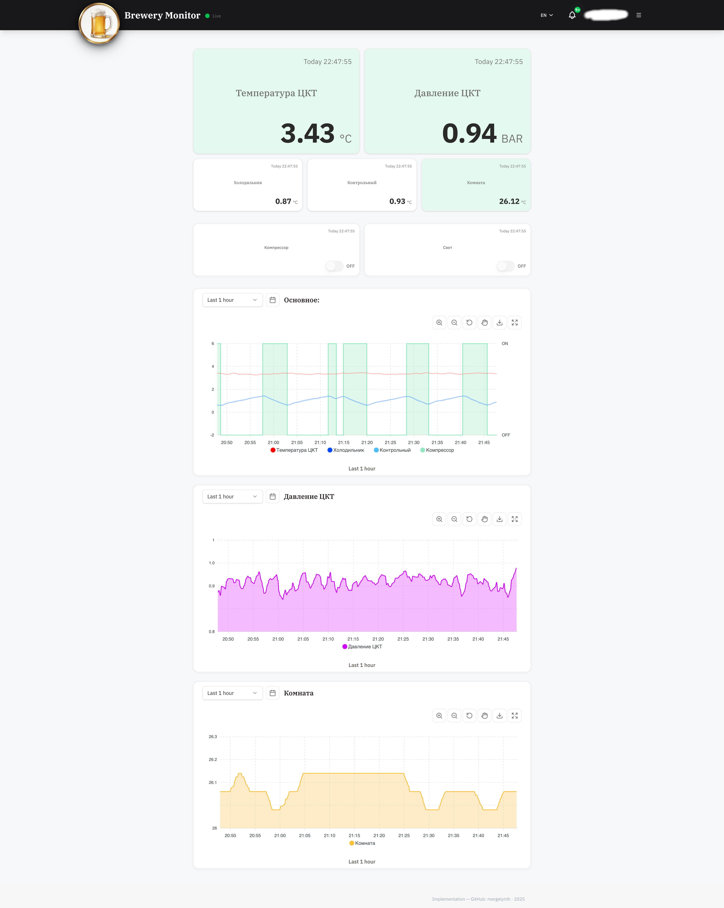
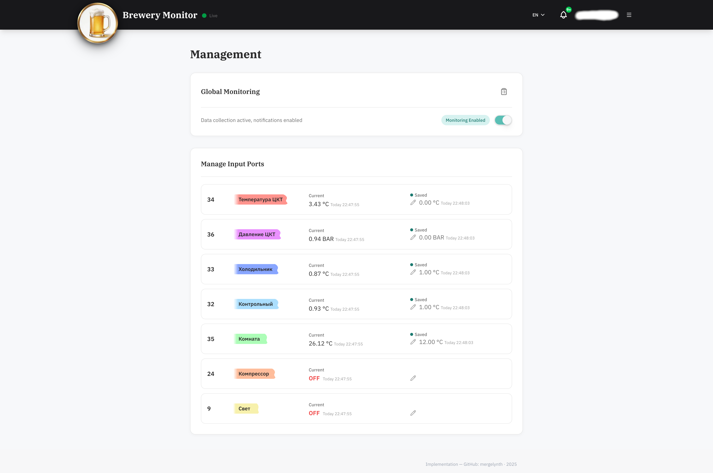
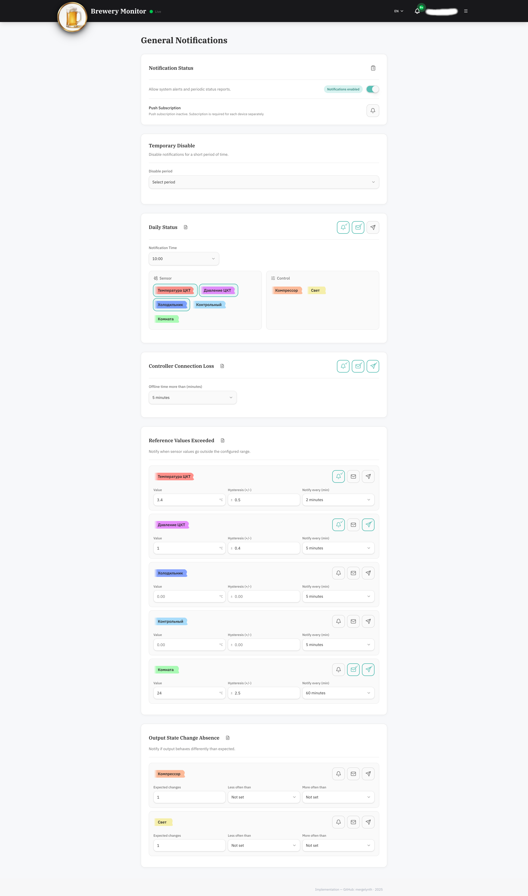
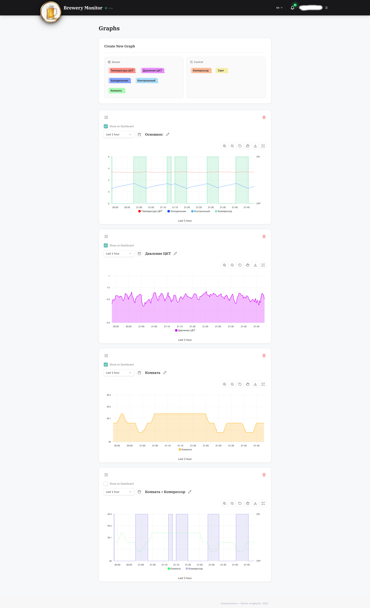
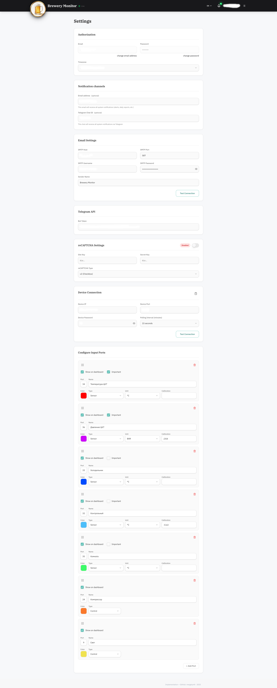

# Brew Monitor  
**Home Brewery Monitoring & Control System**

Brew Monitor is a full-stack system for monitoring and controlling home brewery equipment in real time.  
The platform combines live telemetry, historical analytics, remote device control, and smart notifications
in a modern Progressive Web App.

> ⚠️ This repository contains **documentation and visual materials only**.  
> Application source code, infrastructure, and configuration are maintained in private repositories.

---

## ✨ Core Features

- 📊 Real-time sensor data monitoring
- 🎛️ Remote control of brewery equipment
- 📈 Historical data storage and visualization
- 🔔 Smart notifications (multiple channels)
- 📱 Progressive Web App (mobile & desktop)
- 🌍 Multi-language interface (EN / UA / RU)
- ⏱️ High-resolution time-series telemetry
- 🔐 Role-based access control

---

## 🧱 System Overview

### Backend
- Event-driven architecture
- Real-time data processing
- Secure authentication and authorization
- Notification orchestration layer
- Scalable API for device integrations

### Frontend
- Modern PWA interface
- Live dashboards and charts
- Responsive UI for mobile, tablet, and desktop
- Offline-ready with background sync
- Real-time updates via persistent connections

### Data Layer
- Time-series optimized storage
- Efficient aggregation for long-term analytics
- Data smoothing and anomaly handling
- Reliable historical retention

---

## 🛠️ Technology Stack (High-Level)

| Layer | Technologies |
|-----|-------------|
| Backend | Node.js, TypeScript, NestJS |
| Frontend | Next.js (App Router), React, Tailwind CSS |
| Database | PostgreSQL (time-series optimized) |
| Realtime | WebSocket-based communication |
| Notifications | Push notifications, messaging services |
| PWA | Service Workers, offline cache, installable UI |

> Implementation details, schemas, and configurations are intentionally omitted.

---

## 📱 Progressive Web App

- Installable on **iOS, Android, and Desktop**
- Offline-first UI
- Background data synchronization
- Push notification support
- Fast load times and responsive UX

---

## 🌐 Internationalization

The interface supports multiple languages:
- 🇬🇧 English  
- 🇺🇦 Ukrainian  
- 🇷🇺 Russian  

Language selection is automatic and can be adjusted by the user.

---

## 📸 Screenshots

### Main Dashboard

### Management Panel

### Planning Rules

### Notifications Overview

### Graph and Analytics

### Settings Page

---

## 🔒 Security & Privacy

This repository **does not contain**:
- Source code
- Environment variables or secrets
- API endpoints or routes
- Authentication credentials
- Infrastructure or deployment instructions

All sensitive components are stored separately in private repositories.

---

## 📄 License

MIT License

---

## 📌 Notes

This project is designed as a modular and extensible platform for home brewery automation.
The public materials are intended for demonstration, documentation, and presentation purposes only.
